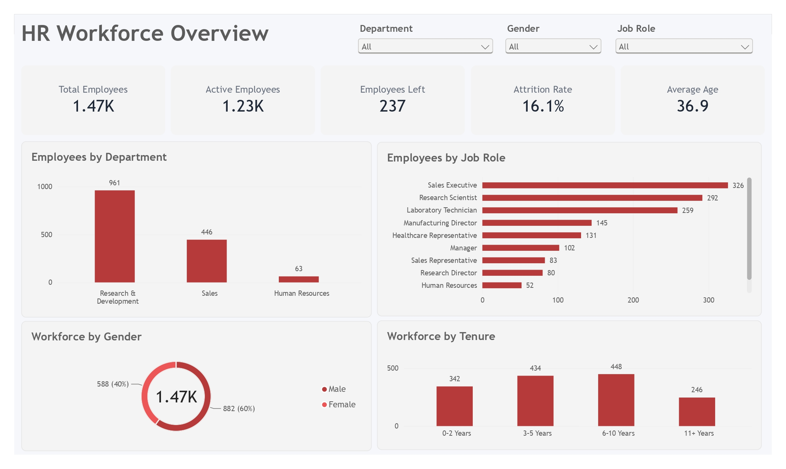
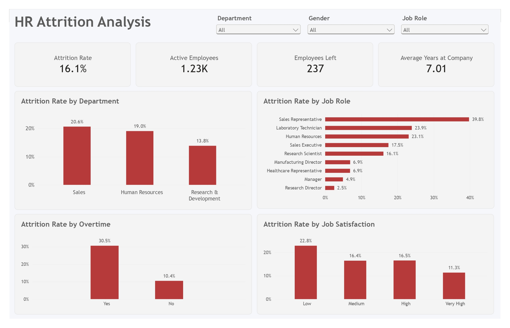
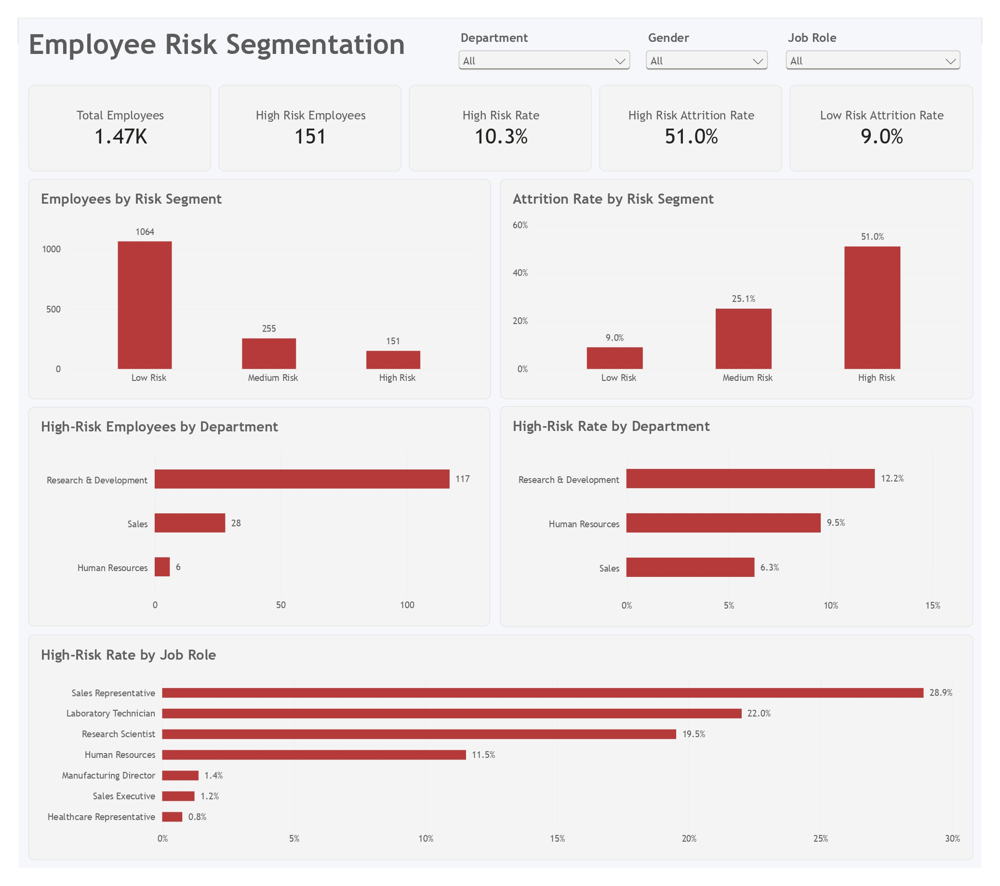

# HR Workforce Analytics: Employee Attrition, Performance & Retention

An end-to-end HR analytics project focused on understanding employee attrition, identifying workforce patterns, and segmenting employees based on employee retention risk.

This project combines **PostgreSQL, Python, statistical analysis, rule-based risk segmentation, and Power BI** to transform employee-level HR data into structured business insights and actionable retention recommendations.

---

## 1. Business Context

Employee attrition can create significant challenges for organizations, including recruitment costs, productivity loss, knowledge loss, and disruption to workforce planning.

Understanding **where attrition occurs, which employee groups show higher attrition, and which workforce segments require greater retention attention** can help HR teams develop more targeted workforce strategies.

This project analyzes employee workforce data to identify attrition patterns and develop an analytical risk segmentation framework that can support HR retention monitoring.

---

## 2. Business Problem

The HR team needs to understand:

- What does the current workforce structure look like?
- What is the overall employee attrition rate?
- Which departments and job roles have higher attrition?
- Which employee characteristics are statistically associated with attrition?
- Which employees fall into higher retention-risk segments?
- Which departments and job roles have higher concentrations of high-risk employees?
- How can HR prioritize retention efforts based on the available data?

---

## 3. Project Objectives

The main objectives of this project are to:

1. Understand the demographic and workforce structure.
2. Analyze employee attrition patterns.
3. Identify categorical factors statistically associated with attrition.
4. Measure the practical strength of categorical associations using Cramér's V.
5. Develop a rule-based employee retention risk segmentation framework.
6. Identify departments and job roles with higher workforce risk exposure.
7. Build an interactive Power BI dashboard for HR decision support.
8. Translate analytical findings into actionable business recommendations.

---

## 4. Dataset

This project uses the **IBM HR Analytics Employee Attrition & Performance** dataset.

The dataset contains employee-level information covering:

- Demographics
- Job characteristics
- Compensation
- Employee satisfaction
- Work experience
- Performance
- Overtime
- Attrition status

### Dataset Size

- **1,470 employees**
- **35 original columns**
- **32 columns in the cleaned analytical dataset**

The original dataset contains several administrative and constant fields that provide limited analytical value. These were reviewed and removed during the data cleaning process where appropriate.

---

## 5. Data Dictionary

The dataset contains employee attributes covering several HR dimensions.

### Demographic Information

| Column               | Description                                       |
| -------------------- | ------------------------------------------------- |
| `age`                | Employee age                                      |
| `gender`             | Employee gender                                   |
| `marital_status`     | Employee marital status                           |
| `education`          | Employee education level                          |
| `education_field`    | Employee education field                          |
| `distance_from_home` | Distance between employee residence and workplace |

### Job & Workforce Information

| Column                    | Description                               |
| ------------------------- | ----------------------------------------- |
| `department`              | Employee department                       |
| `job_role`                | Employee job role                         |
| `job_level`               | Employee job level                        |
| `business_travel`         | Frequency of business travel              |
| `years_at_company`        | Years worked at the company               |
| `years_in_current_role`   | Years in the current role                 |
| `years_with_curr_manager` | Years working with the current manager    |
| `num_companies_worked`    | Number of companies previously worked for |
| `total_working_years`     | Total years of professional experience    |
| `over_time`               | Whether the employee works overtime       |

### Compensation & Career Information

| Column                       | Description                       |
| ---------------------------- | --------------------------------- |
| `daily_rate`                 | Daily compensation-related rate   |
| `hourly_rate`                | Hourly compensation-related rate  |
| `monthly_income`             | Monthly income                    |
| `monthly_rate`               | Monthly compensation-related rate |
| `percent_salary_hike`        | Percentage salary increase        |
| `stock_option_level`         | Employee stock option level       |
| `years_since_last_promotion` | Years since the last promotion    |

### Employee Experience

| Column                      | Description                               |
| --------------------------- | ----------------------------------------- |
| `environment_satisfaction`  | Satisfaction with the work environment    |
| `job_involvement`           | Level of employee involvement in the job  |
| `job_satisfaction`          | Job satisfaction level                    |
| `relationship_satisfaction` | Satisfaction with workplace relationships |
| `work_life_balance`         | Employee work-life balance rating         |
| `training_times_last_year`  | Number of training sessions attended      |

### Performance & Attrition

| Column               | Description                           |
| -------------------- | ------------------------------------- |
| `performance_rating` | Employee performance rating           |
| `attrition`          | Whether the employee left the company |

---

## 6. Tools & Technologies

### Programming & Data Analysis

- Python
- Pandas
- NumPy
- SciPy
- Matplotlib
- Seaborn

### Database & SQL

- PostgreSQL
- SQL
- CTEs
- Aggregations
- CASE statements
- Analytical views

### Statistical Analysis

- Chi-Square Test of Independence
- Bonferroni Multiple Testing Correction
- Cramér's V

### Business Intelligence

- Microsoft Power BI
- DAX
- KPI Cards
- Interactive Slicers
- Workforce Analysis
- Attrition Analysis
- Risk Segmentation

### Development & Version Control

- Git
- GitHub
- Python Virtual Environment

---

## 7. Project Workflow

The project follows an end-to-end analytical workflow:

```text
Raw Dataset
    ↓
Data Understanding & Profiling
    ↓
Data Cleaning & Validation
    ↓
PostgreSQL Data Storage
    ↓
SQL Analytical View
    ↓
SQL Workforce & Attrition Analysis
    ↓
Python Exploratory Data Analysis
    ↓
Categorical Statistical Analysis
    ↓
Employee Risk Segmentation
    ↓
Power BI Dashboard
    ↓
Business Insights
    ↓
Business Recommendations
```

---

## 8. Data Understanding

The initial profiling process evaluated:

- Dataset dimensions
- Column names
- Data types
- Missing values
- Duplicate records
- Unique values
- Descriptive statistics
- Constant variables
- Potential outliers
- Business relevance of variables

The original dataset contains **1,470 employee records across 35 columns**.

The profiling stage established the data quality baseline before transformation and analysis.

Notebook:

```text
notebooks/01_data_understanding.ipynb
```

---

## 9. Data Cleaning

The cleaning process prepared the dataset for SQL, Python, and Power BI analysis.

Key steps included:

- Standardizing column names
- Reviewing and removing irrelevant variables
- Removing constant variables
- Validating categorical values
- Reviewing numerical ranges
- Checking duplicate records
- Validating the attrition variable
- Reviewing potential outliers
- Creating the cleaned analytical dataset

The resulting dataset was saved as:

```text
data/processed/hr_employee_attrition_clean.csv
```

Notebook:

```text
notebooks/02_data_cleaning.ipynb
```

---

## 10. PostgreSQL Analysis

PostgreSQL was used as the analytical database layer.

The database workflow included:

1. Creating the employee attrition table
2. Loading the cleaned dataset
3. Validating the imported data
4. Creating an analytical view
5. Performing workforce analysis
6. Performing attrition analysis

### SQL Analysis Areas

The SQL analysis covers:

- Total workforce
- Active employees
- Employees who left
- Attrition rate
- Workforce distribution by department
- Workforce distribution by job role
- Attrition by department
- Attrition by job role
- Employee attrition characteristics

SQL scripts:

```text
sql/01_create_employee_attrition_table.sql
sql/02_validate_employee_attrition.sql
sql/03_create_analytical_view.sql
sql/04_workforce_overview.sql
sql/05_attrition_analysis.sql
```

---

## 11. Exploratory Data Analysis

Python was used to explore workforce and attrition patterns in greater detail.

The exploratory analysis covered:

- Workforce demographics
- Department distribution
- Job role distribution
- Age distribution
- Tenure
- Income
- Overtime
- Employee satisfaction
- Attrition patterns
- Relationships between employee characteristics and attrition

The analysis was designed to progress from descriptive exploration toward statistically supported findings.

Notebook:

```text
notebooks/03_exploratory_data_analysis.ipynb
```

---

## 12. Categorical Statistical Analysis

The project uses the **Chi-Square Test of Independence** to determine whether categorical employee characteristics are statistically associated with employee attrition.

The analysis examined 14 categorical or ordinal variables, including:

- Overtime
- Business travel
- Department
- Education field
- Job role
- Marital status
- Gender
- Job satisfaction
- Environment satisfaction
- Job involvement
- Relationship satisfaction
- Work-life balance
- Stock option level
- Performance rating

The significance level was:

```text
α = 0.05
```

Because multiple statistical tests were performed, a **Bonferroni correction** was applied to control the family-wise error rate.

### Effect Size

Cramér's V was calculated to measure the practical strength of categorical associations.

After Bonferroni correction, **9 categorical variables remained statistically significantly associated with attrition**:

1. Overtime
2. Job Role
3. Stock Option Level
4. Marital Status
5. Job Involvement
6. Business Travel
7. Environment Satisfaction
8. Job Satisfaction
9. Work-Life Balance

The strongest association was observed for:

| Variable           | Cramér's V | Effect Size |
| ------------------ | ---------: | ----------- |
| Overtime           |      0.244 | Small       |
| Job Role           |      0.242 | Small       |
| Stock Option Level |      0.203 | Small       |
| Marital Status     |      0.177 | Small       |

All statistically significant associations had relatively small effect sizes.

Notebook:

```text
notebooks/05_categorical_statistical_analysis.ipynb
```

---

## 13. Employee Retention Risk Analysis

A rule-based employee risk segmentation framework was developed using selected attrition-related employee characteristics.

The framework assigns risk points based on predefined analytical rules and groups employees into:

- **Low Risk**
- **Medium Risk**
- **High Risk**

### Risk Segment Results

| Risk Segment | Employees | Workforce Share | Observed Attrition Rate |
| ------------ | --------: | --------------: | ----------------------: |
| Low Risk     |     1,064 |           72.4% |                    9.0% |
| Medium Risk  |       255 |           17.3% |                   25.1% |
| High Risk    |       151 |           10.3% |                   51.0% |

The High Risk segment represents only **10.3% of the workforce**, but has an observed attrition rate of approximately **51.0%**.

This indicates a substantial difference in historical attrition across the risk segments.

However, the segmentation is a **rule-based analytical framework**, not a predictive machine learning model. The observed attrition rates should not be interpreted as individual probabilities of leaving.

Notebook:

```text
notebooks/04_employee_risk_segmentation.ipynb
```

---

## 14. Power BI Dashboard

The final Power BI dashboard contains three pages designed for different HR analytical purposes.

### Page 1 — Workforce Overview

Provides a high-level view of the workforce structure.

Key elements include:

- Total Employees
- Active Employees
- Employees Left
- Attrition Rate
- Average Age
- Employees by Department
- Employees by Job Role
- Workforce by Gender
- Workforce by Tenure



---

### Page 2 — Attrition Analysis

Focuses on employee attrition patterns across workforce dimensions.

Key elements include:

- Attrition Rate
- Active Employees
- Employees Left
- Average Years at Company
- Attrition Rate by Department
- Attrition Rate by Job Role
- Attrition Rate by Overtime
- Attrition Rate by Job Satisfaction



---

### Page 3 — Employee Risk Segmentation

Focuses on employee retention risk and high-risk workforce concentration.

Key elements include:

- Total Employees
- High Risk Employees
- High Risk Rate
- High Risk Attrition Rate
- Low Risk Attrition Rate
- Employees by Risk Segment
- Attrition Rate by Risk Segment
- High-Risk Employees by Department
- High-Risk Rate by Department
- High-Risk Rate by Job Role



---

## 15. Key Insights

### Workforce Overview

The dataset contains **1,470 employees**.

The workforce consists of:

- **1,233 active employees**
- **237 employees who left**
- **16.1% overall attrition rate**

This provides the baseline workforce context for the subsequent attrition and risk analysis.

---

### Attrition & Overtime

Overtime shows the strongest categorical association with attrition among the variables tested.

Its Cramér's V is:

```text
V = 0.244
```

The association is statistically significant after Bonferroni correction, although the effect size remains small.

This indicates that overtime is an important factor to monitor when examining attrition patterns, but it should not be treated as a standalone explanation for employee turnover.

---

### Risk Segmentation

The rule-based risk segmentation produces a clear separation in observed historical attrition:

- Low Risk: **9.0%**
- Medium Risk: **25.1%**
- High Risk: **51.0%**

The High Risk segment contains **151 employees**, representing **10.3% of the workforce**.

This makes the High Risk segment particularly useful for prioritizing retention analysis.

---

### High-Risk Workforce Concentration

Research & Development has the largest number of High Risk employees.

At the job-role level, Sales Representatives show the highest High-Risk Rate among the analyzed roles.

These groups may warrant deeper investigation into factors such as:

- Overtime
- Job satisfaction
- Work-life balance
- Job involvement
- Business travel
- Career progression

---

### Employee Experience

Job satisfaction is statistically associated with attrition after multiple-testing correction.

Employees with lower job satisfaction show higher observed attrition than employees with higher satisfaction levels.

This suggests that employee experience indicators can be useful dimensions for HR retention monitoring when considered together with other workforce characteristics.

---

## 16. Business Recommendations

### 1. Monitor Overtime Exposure

HR should monitor overtime patterns across departments and job roles.

Potential actions include:

- Reviewing workload distribution
- Monitoring overtime frequency
- Evaluating staffing requirements
- Redistributing workload where appropriate

---

### 2. Prioritize High-Risk Employees for Retention Monitoring

The High Risk segment should be used as a prioritization framework for HR analysis.

Instead of applying the same retention strategy to every employee, HR can focus deeper investigation on groups showing multiple risk indicators.

---

### 3. Conduct Targeted Department & Job Role Analysis

Departments and job roles with higher attrition or high-risk exposure should receive additional investigation.

Particular attention can be given to:

- Research & Development
- Sales Representatives
- Other job roles with elevated attrition or risk rates

---

### 4. Monitor Employee Experience

HR can incorporate employee experience indicators into regular workforce monitoring.

Potential areas include:

- Job satisfaction
- Environment satisfaction
- Job involvement
- Work-life balance
- Employee engagement

These indicators should be evaluated together rather than used as standalone decision criteria.

---

### 5. Combine Multiple Signals

The analysis suggests that employee attrition is associated with multiple workforce characteristics rather than a single factor.

Therefore, retention strategies should combine:

**Workload + Employee Experience + Job Characteristics + Workforce Risk Profile**

rather than focusing on one variable alone.

---

## 17. Limitations

Several limitations should be considered when interpreting the findings.

### Dataset Limitations

The project uses a publicly available HR analytics dataset and may not represent the workforce structure or behavior of a specific real-world organization.

### No Causal Inference

The statistical analysis identifies associations rather than causal relationships.

For example, an association between overtime and attrition does not prove that overtime directly causes employees to leave.

### Limited Longitudinal Information

The dataset does not provide detailed employee exit dates or longitudinal workforce history. Therefore, the project does not perform true time-to-event or survival analysis.

### Rule-Based Risk Segmentation

The risk segmentation is based on predefined analytical rules.

It should be treated as a **retention prioritization framework**, not as a production-grade predictive model.

### Statistical Testing

Bonferroni correction makes the statistical analysis more conservative by controlling the family-wise error rate.

The `education_field` variable also contained one expected frequency below 5 in its contingency table. Therefore, its Chi-Square result should be interpreted with caution.

---

## 18. Future Improvements

Future development could extend this project toward predictive and prescriptive HR analytics.

Potential improvements include:

- Building an employee attrition prediction model
- Comparing Logistic Regression, Random Forest, and Gradient Boosting
- Applying cross-validation and hyperparameter tuning
- Using SHAP for model explainability
- Developing probability-based attrition risk scores
- Adding compensation benchmarking
- Incorporating employee engagement survey data
- Adding longitudinal workforce data
- Performing survival analysis
- Automating Power BI data refresh
- Developing an automated HR retention monitoring system

---

## 19. Repository Structure

```text
hr-workforce-analytics/
│
├── data/
│   ├── raw/
│   │   └── WA_Fn-UseC_-HR-Employee-Attrition.csv
│   └── processed/
│       └── hr_employee_attrition_clean.csv
│
├── notebooks/
│   ├── 01_data_understanding.ipynb
│   ├── 02_data_cleaning.ipynb
│   ├── 03_exploratory_data_analysis.ipynb
│   ├── 04_employee_risk_segmentation.ipynb
│   └── 05_categorical_statistical_analysis.ipynb
│
├── sql/
│   ├── 01_create_employee_attrition_table.sql
│   ├── 02_validate_employee_attrition.sql
│   ├── 03_create_analytical_view.sql
│   ├── 04_workforce_overview.sql
│   └── 05_attrition_analysis.sql
│
├── dashboard/
│   └── dashboard.pbix
│
├── images/
│   ├── dashboard_workforce_overview.png
│   ├── dashboard_attrition_analysis.png
│   └── dashboard_risk_segmentation.png
│
├── reports/
│
├── src/
│   ├── database.py
│   └── __init__.py
│
├── .env
├── requirements.txt
├── .gitignore
└── README.md
```

---

## Author

**Muhamad Rukhul Kirom**

Data Analyst Portfolio Project

---

## Project Outcome

This project demonstrates an end-to-end **HR Workforce Analytics** workflow:

**Data → SQL → Python → Statistical Analysis → Risk Segmentation → Power BI → Business Insights**

The final analysis provides a structured framework for understanding:

- Workforce composition
- Employee attrition
- Statistical associations
- Retention risk
- High-risk workforce concentration
- Potential retention priorities

The project demonstrates practical Data Analyst capabilities in **data cleaning, SQL analysis, exploratory data analysis, statistical testing, analytical segmentation, data visualization, and business communication**.
